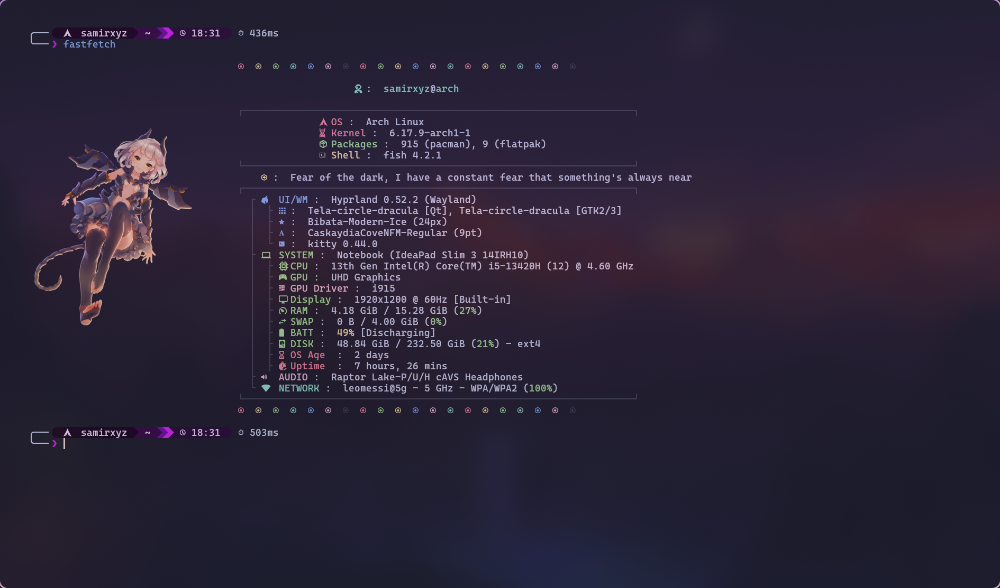

# Fastfetch Config

This repository contains my personal custom configuration for [fastfetch](https://github.com/fastfetch-cli/fastfetch), a fast, highly customizable system information tool (and a modern, maintained alternative to neofetch).

The config is tailored to my preferences, featuring a clean and aesthetically pleasing layout with custom logos, colors, and modules.

## Preview

Here's an example of what the output looks like when running `fastfetch` with this config:
<p align="center">
  
</p>

*(Note: The actual appearance may vary based on your system, terminal font, and any customizations in the config file.)*

## Installation / Usage

1. Make sure you have fastfetch installed. See the official repo for installation instructions: https://github.com/fastfetch-cli/fastfetch

2. Clone this repository or download the config file(s):

   ```bash
   git clone https://github.com/notsopreety/fastfetch.git
   ```

3. Copy the config file (usually `config.jsonc`) to the fastfetch config directory:

   ```bash
    mkdir -p ~/.config/fastfetch
    cp config.jsonc ~/.config/fastfetch/config.jsonc
    cp -r logo ~/.config/fastfetch/
   ```

   (Adjust the filename/path if your repo uses a different name.)

4. Run fastfetch:

   ```bash
   fastfetch
   ```

Feel free to tweak the config to suit your style!


If you like it, star the repo ⭐